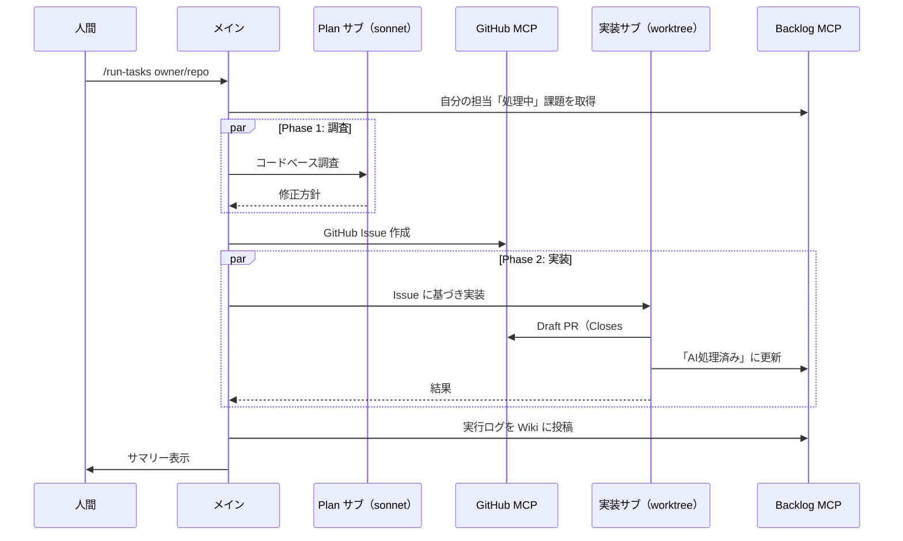

# Claude Run Tasks

Backlog 課題 → コード調査 → GitHub Issue → Draft PR を自動化する Claude Code プラグイン。

## 前提条件

- [Claude Code CLI](https://docs.anthropic.com/en/docs/claude-code) インストール済み
- Node.js 18+ / npx
- Git

## フロー



## セットアップ

```bash
git clone https://github.com/nohara-kengo/claude-state-manager.git
cd claude-state-manager

# MCP サーバー登録
claude mcp add backlog \
  -e BACKLOG_DOMAIN=<your-space>.backlog.com \
  -e BACKLOG_API_KEY=<your-key> \
  -- npx -y backlog-mcp-server

claude mcp add github \
  -e GITHUB_PERSONAL_ACCESS_TOKEN=<your-pat> \
  -- npx -y @modelcontextprotocol/server-github
```

## 使い方

```bash
# 1. Backlog に課題を作成し、担当者を自分にする
# 2. 実行
claude --yes --max-budget-usd 5 -p "/run-tasks nohara-kengo/claude-state-manager"
# 3. Draft PR をレビュー → マージ
```

`/run-tasks` の引数は GitHub リポジトリ（`owner/repo`）。PR 作成先として使用。
自分の担当課題のみ処理。他人の課題には触れません。

## 権限設定

`settings.json` で `Bash(*)` を全許可しています。`--yes` 実行時にコマンド確認で止まらないようにするためです。

安全性は以下で担保:
- 実装は worktree 内で実行 → 本体に影響しない
- git 管理下なので誤削除しても復元可能
- 最終的に人間が Draft PR をレビューしてからマージ

## 実行オプション

| フラグ | 説明 |
|--------|------|
| `--yes` | 許可プロンプトを自動承認 |
| `-p` | ヘッドレス実行 |
| `--max-budget-usd N` | 予算上限（USD）。超過で停止、再実行で続行可 |
| `--max-turns N` | ターン数上限 |

```bash
# cron 例: 毎日 22:00 に自動実行
0 22 * * * cd /path/to/repo && claude --yes --max-budget-usd 10 -p "/run-tasks owner/repo"
```

## コスト・リソースの工夫

| 工夫 | 効果 |
|------|------|
| 調査と実装を2フェーズに分離 | 方針ミス時はPhase 1のコストだけで済む |
| 優先度×種別でモデル使い分け | 高優先=opus / 中=sonnet / 低=haiku（CLAUDE.md参照） |
| Phase 1 は全件 sonnet（読取専用） | コード生成しないので安いモデルで十分 |
| サブエージェント委譲 | 課題ごとに独立コンテキスト → 完了後に解放 |
| 最大3件バッチ実行 | API レート制限・MCP同時接続の制御 |
| 担当者フィルタ（get_myself） | 自分の課題だけ処理。無駄な課題を読まない |
| MCP 呼び出し最小化 | GitHub MCP=Issue/PR作成のみ、Backlog get_issue=サブから呼ばない |
| Glob/Grep 優先 | ローカル操作=トークン消費なし |
| `--max-budget-usd` | 予算超過で自動停止。再実行で処理済み課題はスキップ |
| Draft PR + Closes #N | マージ時に Issue 自動クローズ。手動操作なし |
| ロックファイル | cron 重複実行を防止 |
| 実行ログ → Backlog Wiki | 実行結果を自動記録。処理時間・エラーコード付きで失敗原因の追跡が容易。リポジトリ名入りタイトルで複数リポジトリ対応 |
| ログレベル（INFO/WARN/ERROR） | 段階的出力制御。正常系・警告・エラーを分類し、ノイズを低減 |
| エラー分類 | MCP失敗・タイムアウト・コンテキスト不足を明示。原因特定を迅速化 |

## コスト確認

| 方法 | 用途 |
|------|------|
| `/cost` | セッションのトークン消費・コスト表示 |
| `CLAUDE_CODE_ENABLE_TELEMETRY=1` | OpenTelemetry でメトリクス収集 |
