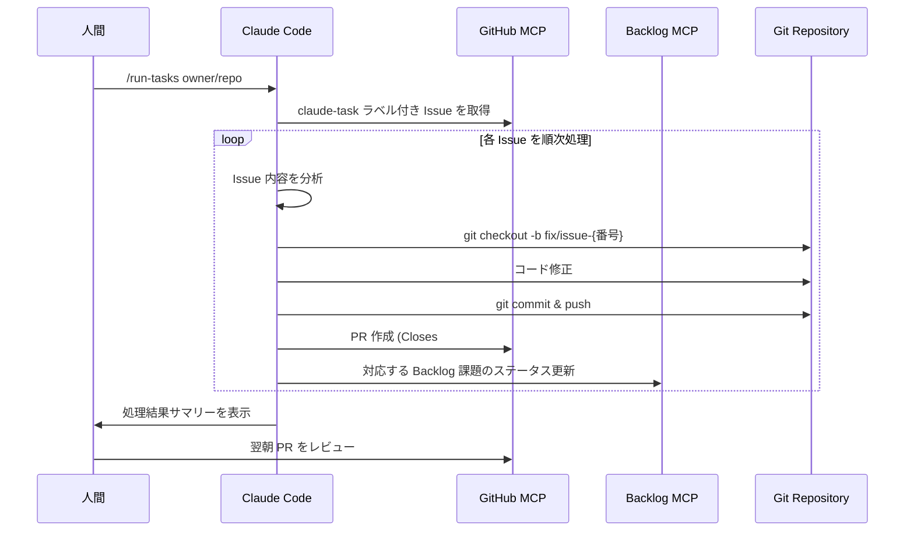
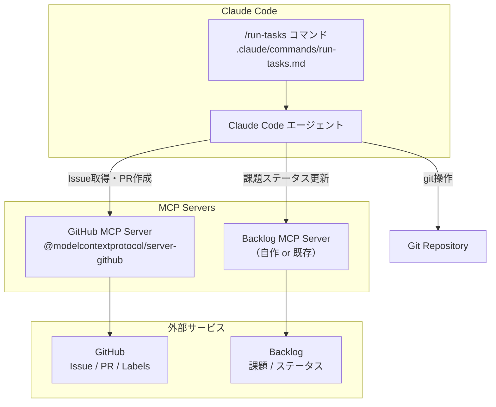
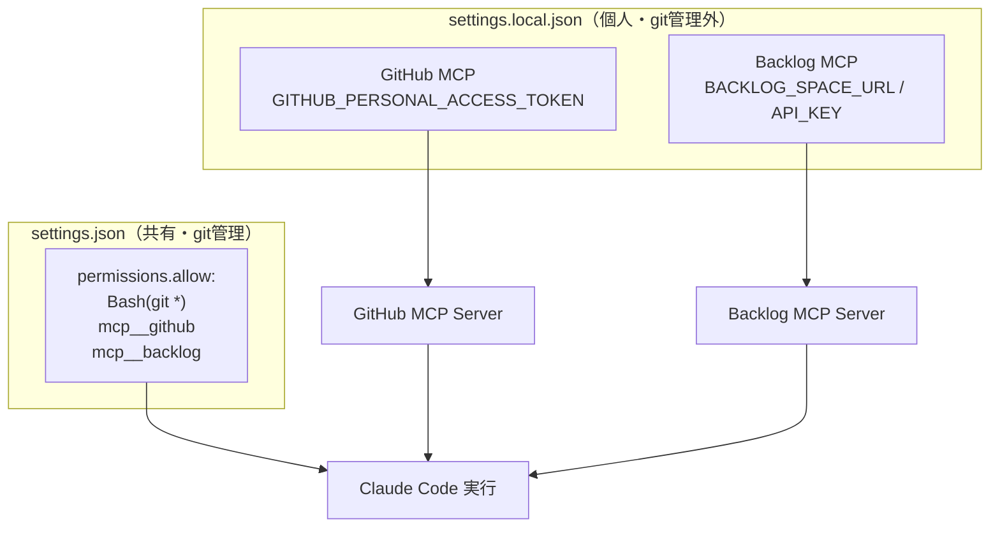

# Claude State Manager

Claude Code のスラッシュコマンド + MCP で、GitHub Issue → コード修正 → PR 作成 → Backlog 連携を自動化するプラグイン。

業務後に `/run-tasks` を実行して放置、翌朝 PR を確認する運用を想定。

## 全体フロー



## アーキテクチャ



## 権限制御



## ファイル構成

```
claude-state-manager/
├── README.md
├── .gitignore
└── .claude/
    ├── settings.json          # 共有設定（permissions）
    ├── settings.local.json    # 個人設定（MCP・トークン）※git管理外
    └── commands/
        └── run-tasks.md       # /run-tasks スラッシュコマンド
```

## セットアップ

### 1. クローン

```bash
git clone https://github.com/nohara-kengo/claude-state-manager.git
cd claude-state-manager
```

### 2. 個人設定

`settings.local.json` にトークンを記入:

```bash
vi .claude/settings.local.json
```

| 環境変数 | 説明 |
|---------|------|
| `GITHUB_PERSONAL_ACCESS_TOKEN` | GitHub Personal Access Token（repo スコープ） |
| `BACKLOG_SPACE_URL` | Backlog スペース URL（例: `https://xxx.backlog.com`） |
| `BACKLOG_API_KEY` | Backlog API キー |

### 3. ラベル作成

対象リポジトリに `claude-task` ラベルを作成:

```bash
gh label create claude-task --repo owner/repo --color 0E8A16
```

### 4. タスクを積む

対象リポジトリで Issue を作成し、`claude-task` ラベルを付与。
Issue 本文がそのまま Claude へのプロンプトになる。

### 5. 実行

```bash
cd 対象リポジトリ
/run-tasks owner/repo
```

## 使い方

```bash
# 1. Issue に claude-task ラベルを付けてタスクを積む
# 2. 帰る前に実行
/run-tasks owner/repo
# 3. 翌朝 PR を確認してマージ
```
