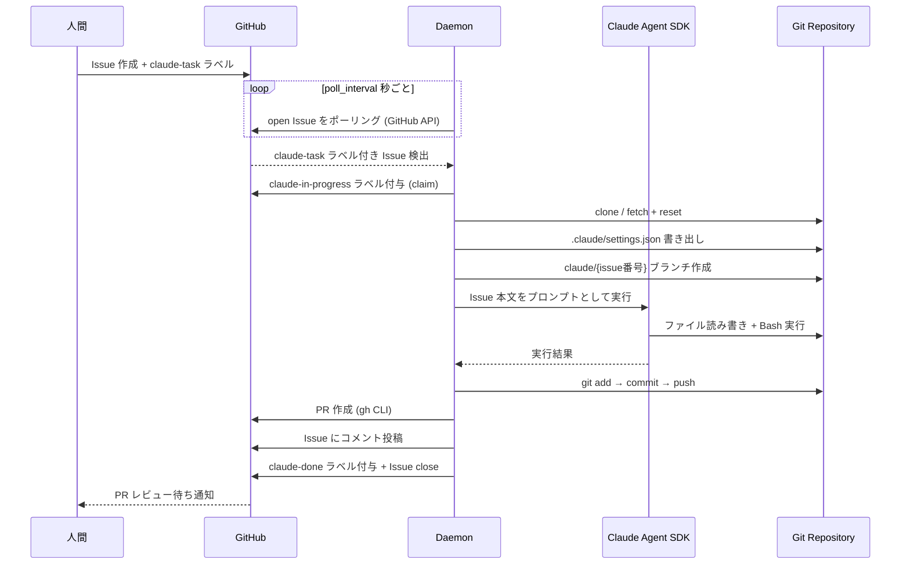
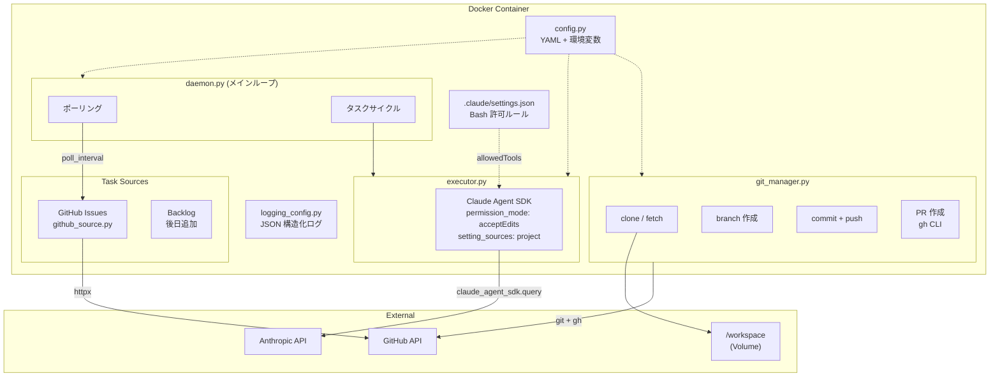
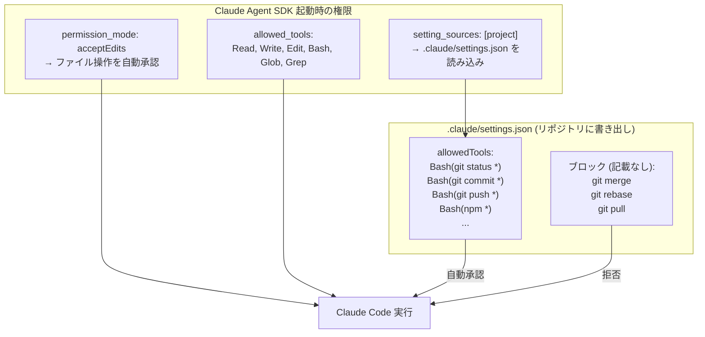
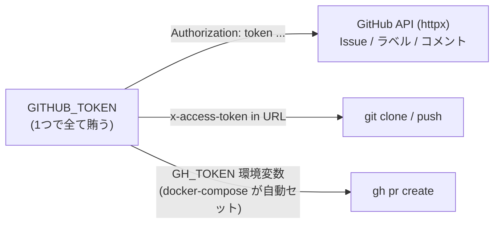

# Claude Code Auto Task Runner

GitHub Issues からタスクを自動取得し、Claude Code (Agent SDK) で実行 → PR 作成まで行う 24/365 無人デーモン。

Issue 本文がそのまま Claude へのプロンプトになる。人間は Issue を書いてラベルを付けるだけ。

## 全体フロー



## アーキテクチャ



## 実行構造

```mermaid
graph LR
    subgraph "docker compose up"
        subgraph "python -m task_runner"
            Main["__main__.py<br/>引数解析 + バリデーション"]
            Main --> DaemonRun["daemon.run()"]

            subgraph "while running ループ"
                DaemonRun --> PollCycle

                PollCycle["_poll_cycle()"]
                PollCycle --> Fetch["source.fetch_pending_tasks()"]
                Fetch --> Claim["source.claim_task()"]
                Claim --> EnsureRepo["git.ensure_repo()"]
                EnsureRepo --> WriteSettings["git.write_claude_settings()"]
                WriteSettings --> CreateBranch["git.create_branch()"]
                CreateBranch --> Execute["executor.execute()"]
                Execute --> HasChanges{"変更あり?"}
                HasChanges -->|Yes| CommitPush["git.commit_and_push()"]
                CommitPush --> CreatePR["git.create_pr()"]
                CreatePR --> Report["source.report_result()"]
                HasChanges -->|No| Report
                Report --> Sleep["sleep(poll_interval)"]
                Sleep --> PollCycle
            end
        end
    end

    Signal["SIGTERM / SIGINT"] -.->|graceful shutdown| DaemonRun
```



### 権限制御の仕組み



## クイックスタート

```bash
# 1. クローン
git clone https://github.com/your-org/claude-state-manager.git
cd claude-state-manager

# 2. 環境変数
cp .env.example .env
# .env を編集: GITHUB_TOKEN, ANTHROPIC_API_KEY を記入

# 3. 設定
cp config.example.yml config.yml
# config.yml を編集: github.repos にリポジトリを記入

# 4. 対象リポジトリにラベル作成
gh label create claude-task --repo your-org/your-repo --color 0E8A16
gh label create claude-in-progress --repo your-org/your-repo --color FBCA04
gh label create claude-done --repo your-org/your-repo --color 5319E7

# 5. 起動
docker compose up -d

# ログ確認
docker compose logs -f
```

## 使い方

1. 監視対象リポジトリに Issue を作成
2. `claude-task` ラベルを付与
3. Issue 本文にタスク内容を記述（これが Claude へのプロンプトになる）
4. デーモンが自動で拾い → 実行 → PR 作成 → Issue close

## セットアップ詳細

### GitHub Token

GitHub Personal Access Token (classic) を作成:

| スコープ | 用途 |
|---------|------|
| `repo` | clone / push / PR 作成 / Issue 操作 |

作成: GitHub → Settings → Developer settings → Personal access tokens → Tokens (classic)

> Fine-grained token の場合: 対象リポジトリに Contents (read/write), Issues (read/write), Pull requests (read/write) を付与。

### 認証フロー



### 環境変数

| 変数 | 必須 | 説明 |
|------|------|------|
| `GITHUB_TOKEN` | Yes | GitHub Personal Access Token (repo スコープ) |
| `ANTHROPIC_API_KEY` | Yes | Anthropic API Key |
| `GIT_USER_NAME` | No | コミットの author name (default: `claude-task-runner`) |
| `GIT_USER_EMAIL` | No | コミットの author email (default: `claude-task-runner@noreply.github.com`) |

### ローカル実行 (Docker なし)

```bash
python3 -m venv .venv
source .venv/bin/activate
pip install -e .

export GITHUB_TOKEN=ghp_xxx
export GH_TOKEN=$GITHUB_TOKEN
export ANTHROPIC_API_KEY=sk-ant-xxx
python -m task_runner -c config.yml
```

## 設定リファレンス

### config.yml

| キー | デフォルト | 説明 |
|------|-----------|------|
| `poll_interval` | `60` | ポーリング間隔（秒） |
| `workspace_dir` | `/workspace` | リポジトリの clone 先 |
| `max_turns` | `50` | Claude の最大ターン数 / タスク |
| `task_timeout` | `1800` | タスクのタイムアウト（秒、デフォルト 30 分） |
| `permission_mode` | `acceptEdits` | Claude の権限モード |
| `allowed_bash_commands` | (下記参照) | Bash 自動承認パターン |
| `github.repos` | `[]` | 監視対象リポジトリ (`owner/repo` 形式) |
| `github.task_label` | `claude-task` | タスク Issue のラベル |
| `github.in_progress_label` | `claude-in-progress` | 実行中ラベル |
| `github.done_label` | `claude-done` | 完了ラベル |

### Bash 自動承認パターン

`allowed_bash_commands` で Claude が Bash で実行できるコマンドを制御。
デフォルトでは `git merge` / `git rebase` / `git pull` は **ブロック**（マージは PR 経由の想定）。

```yaml
allowed_bash_commands:
  # git (merge/rebase/pull を除外)
  - "git status *"
  - "git diff *"
  - "git log *"
  - "git show *"
  - "git branch *"
  - "git checkout *"
  - "git add *"
  - "git commit *"
  - "git push *"
  - "git fetch *"
  - "git stash *"
  - "git rm *"
  - "git mv *"
  - "git tag *"
  # build / test
  - "npm *"
  - "python *"
  - "pytest *"
  - "make *"
  # read-only shell
  - "ls *"
  - "cat *"
  - "find *"
  - "grep *"
```

全コマンド許可する場合は `["*"]` に変更。

内部的にはリポジトリの `.claude/settings.json` に `allowedTools: ["Bash(<pattern>)"]` として書き出され、
`setting_sources: ["project"]` で Claude Agent SDK に読み込まれる。

## ファイル構成

```
├── Dockerfile
├── docker-compose.yml
├── pyproject.toml
├── config.example.yml
├── .env.example
├── TODO.md                  # 残件・改善タスク
└── src/task_runner/
    ├── __main__.py          # CLI エントリポイント
    ├── daemon.py            # メインループ + シグナルハンドリング
    ├── config.py            # YAML + 環境変数から設定読み込み
    ├── models.py            # Task, TaskResult データクラス
    ├── sources/
    │   ├── base.py          # TaskSource Protocol (抽象インターフェース)
    │   └── github_source.py # GitHub Issues アダプタ
    ├── executor.py          # Claude Agent SDK 呼び出し
    ├── git_manager.py       # git clone/branch/commit/push/PR + 認証
    └── logging_config.py    # JSON 構造化ログ
```

## タスクソースの拡張

`TaskSource` Protocol を実装するだけで Backlog 等の新しいソースを追加可能:

```python
class TaskSource(Protocol):
    async def fetch_pending_tasks(self) -> list[Task]: ...
    async def claim_task(self, task: Task) -> bool: ...
    async def report_result(self, task: Task, result: TaskResult) -> None: ...
```

## 既知の制限事項

- デフォルトブランチが `main` 固定（`master` 等には未対応）
- 1 サイクル 1 タスクの順次処理（並行処理は未実装）
- daemon 異常終了時に `claude-in-progress` ラベルが残る可能性あり
- Issue 本文のプロンプトインジェクション対策なし

詳細は [TODO.md](./TODO.md) を参照。
